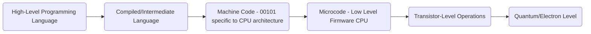
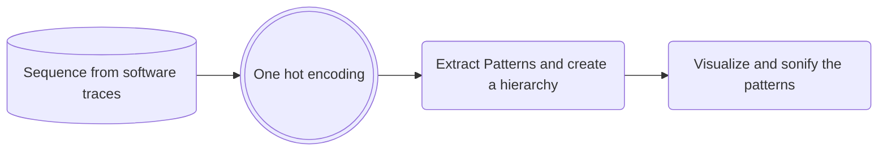
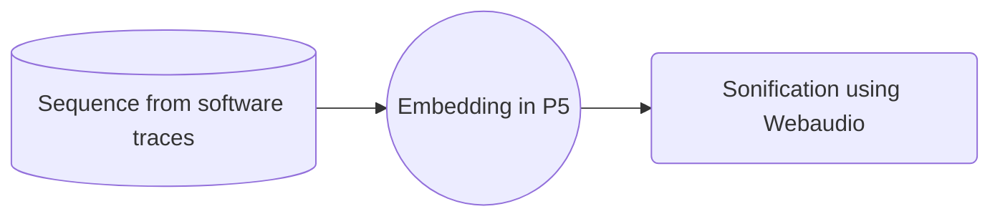

---
{"dg-publish":true,"permalink":"/analysis/system-traces/","tags":["software","traces","cpu"]}
---

### **How does a CPU work?**

> It would be cool to have a map like those of Crawford but for how the CPU works internally, like Cache and stuff. And then sonify these connections after the visualization to display the values.

It’s a microscopic process, a top-down approach to explore how do these things work.

syscall_slow_exit_work stands at the assembly level? But no, it is a kernel function in linux, and linux is built in C. Which in the graph should be Compiled/Intermediate language.

### Now back to the original problem. What are these system traces?

[https://www.kernel.org/doc/Documentation/trace/tracepoints.txt](https://www.kernel.org/doc/Documentation/trace/tracepoints.txt)

[https://blogs.oracle.com/linux/post/taming-tracepoints-in-the-linux-kernel](https://blogs.oracle.com/linux/post/taming-tracepoints-in-the-linux-kernel)

I need to find a “_chiave di lettura_” are the processes in assembly/bytecode or c?

Not exactly system calls, but a trace of system call events. This is an ftrace (function trace) log showing the detailed kernel-level function call sequence during a system call execution:

- Shows kernel internal functions like `mutex_unlock`, `__fsnotify_parent`
- Captures system call workflow
- Includes `syscall_slow_exit_work` and `sys_write`
- Represents low-level kernel execution tracking, not the system calls themselves

These function traces are primarily written in C, but interact closely with assembly:

- Kernel functions in Linux are predominantly written in C
- Critical low-level operations use inline assembly or assembly-level interfaces
- `syscall_slow_exit_work` and related functions are C implementations
- C code translates to assembly instructions for actual hardware execution
- Directly interfaces with CPU architecture at assembly level during execution

The trace shows the C-level function call sequence that ultimately gets translated to assembly and machine instructions.

These traces are a meta-representation - a logging mechanism that captures the internal function call sequence. They provide a diagnostic view of kernel operations, showing the sequence and details of what's happening "behind the scenes" during system call processing, but aren't the actual low-level operations themselves. It's like a detailed debug log of the system's internal workflow.

These traces are describing C behavior, with hooks into assembly. They represent the C-level function call sequence in the Linux kernel, which ultimately gets compiled to and executed as assembly/machine instructions. They're a human-readable representation of the kernel's internal C function calls during system call processing.

  

- **Alternative Take:**

Create a graphical representation, for the sake of simplicity the vertical space represents the event type (I have around 500 events), and the horizontal space its disposition in time.

Dall’analisi delle transizioni sembra possa essere interessante creare una mappa indicando quanto é probabile che un evento segua l’altro.

  

## Trace to sound

  

  
