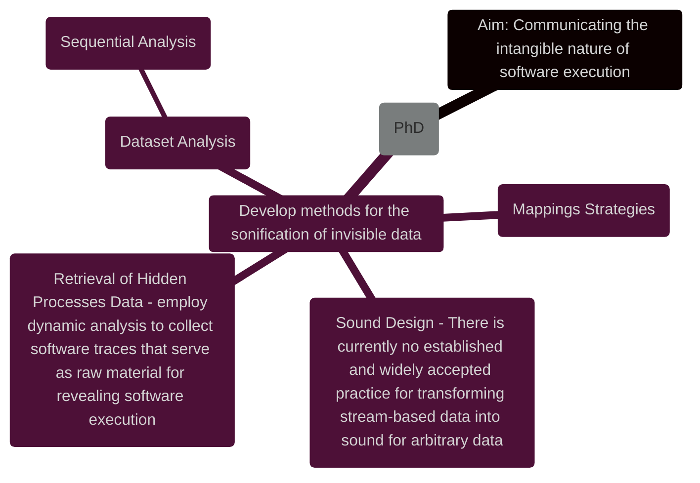
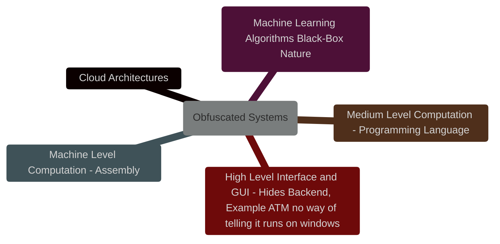
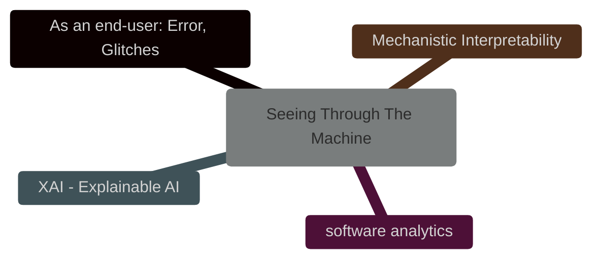

---
{"dg-publish":true,"permalink":"/analysis/tools-for-database-and-software-analysis/","tags":["software","database","analysis"],"noteIcon":""}
---


_Software is fluid, it’s never still, it always moves._

| - Sequence Mining Techniques<br>    - Sequence Pattern Mining (SPM)<br>    - Prefix Span Algorithm<br>    - Sequential Pattern Discovery Using Sequence Database (SPADE)<br>    | - Statistical Methods<br>    - Time series analysis<br>    - Markov chain modeling<br>    - Event correlation analysis<br>                        |
| ------------------------------------------------------------------------------------------------------------------------------------------------------------------------------- | ------------------------------------------------------------------------------------------------------------------------------------------------- |
| **- Machine Learning Approaches<br>    - Recurrent Neural Networks (RNNs)<br>    - Long Short-Term Memory (LSTM) networks<br>    - Temporal Convolutional Networks (TCNs)**<br> | **- Trace Analysis Techniques<br>    - Event log parsing<br>    - Transition matrix creation<br>    - Frequency analysis of event sequences**<br> |

https://github.com/huggingface/text-clustering

Transition matrix → between

**entropy of information** - the longest the starting status the more entropy - the shorter the less

entropy 0 is the least possible event

try and explore the obvious to less obvious interactively with p5.js interface - markov

---

**Scope: creating software, which will be used later in the program, to read into tracing data, turning it into datasets, and finding ways to portray several visualizations easily.**

---

- [x] Transform the data into a dataset.
- [x] Text-clustering, fixing and test
- [x] LLM for event retrieval - else use regex
- [x] Windowing of elements
- [x] Sequence analysis of data
- [ ] Study sequential modeling as done in librosa.

---

**Current Problem: I need to extract patterns from the data and see how they are connected to each other.**

Why? I want meta-objects. I need meaningful informations.

- **Strategy 1:**

- [ ] Feed the LLM with windowed sequences (maybe with overlapping) and ask it to classify symbolically.

- **Strategy 2:**

- [x] Sequence pattern mining. Give windowed sequences to the system and retrieve patterns.
    
    **Result** - The algorithm should be fine-tuned to the task, because it returns a lot of 1 event sequences, although it is visible that there is no huge pattern connection between most elements. Although syscall_slow_exit_work does have a sort of connection with certain events, as visible in the snippet below.
    

```JavaScript
syscall_slow_exit_work transitions:
  -> fpregs_assert_state_consistent: 0.84
  -> exit_to_usermode_loop: 0.07
```

I’ve also got to check other aspects like windowing with skipping elements? But I don’t know if that makes sense. Which is the connection between these single elements? Is there one? Are they somewhat related? Is a CPU thread executing multiple events at a time or single ones but really fast?

Ah this is interesting: [https://www.bbc.co.uk/bitesize/guides/zws8d2p/revision/2](https://www.bbc.co.uk/bitesize/guides/zws8d2p/revision/2)

So it’s executing one event at a time, and, since this is something I did not know, it may also be something the layperson isn’t aware of.

Another aspect I forgot to consider for my Database is the CPU thread and the task-pid.

[https://wikileaks.org/ciav7p1/](https://wikileaks.org/ciav7p1/)

[https://www.sciencedirect.com/science/article/pii/S2666281721001293](https://www.sciencedirect.com/science/article/pii/S2666281721001293)

> [!Warning] ==**IMPORTANT: I must know what these data points actually mean. I need to gather an understanding of these traces.**==

[[Analysis/System traces\|_]]


---

**What is the main purpose of my research?**



**Which are the obfuscated systems of software?**



**How can we get a sense of software’s hidden work?**



---

## How do I enhance the perception of these systems/architectures?

## How can I look at software, how many angles, how many POV?

I think I should decide _n_ systems/architectures and proceed with studying them.

---

### Relevant Informations:

---


Kate Crawford is interested in materializing the system and showing its true impact. The materiality of the system, like mining, server location, construction, etc.. is not my main focus, although I can mention this as another way of looking through the system. We built systems so complicated that now we need to find new ways of communicating about them and we don’t understand them anymore. It’s like Ioana was saying that she had to look at how a computer works on a base level and that made her start from the transistor itself.

  

[https://extractivism.online/](https://extractivism.online/)

[https://calculatingempires.net/](https://calculatingempires.net/)

[[Analysis/Log Monitoring\|Log Monitoring]]
[[Analysis/Shadow AI\|Shadow AI]]
[[Analysis/Anomaly Detection\|Anomaly Detection]]
[[Analysis/System traces\|System traces]]

[[Home\|_]]